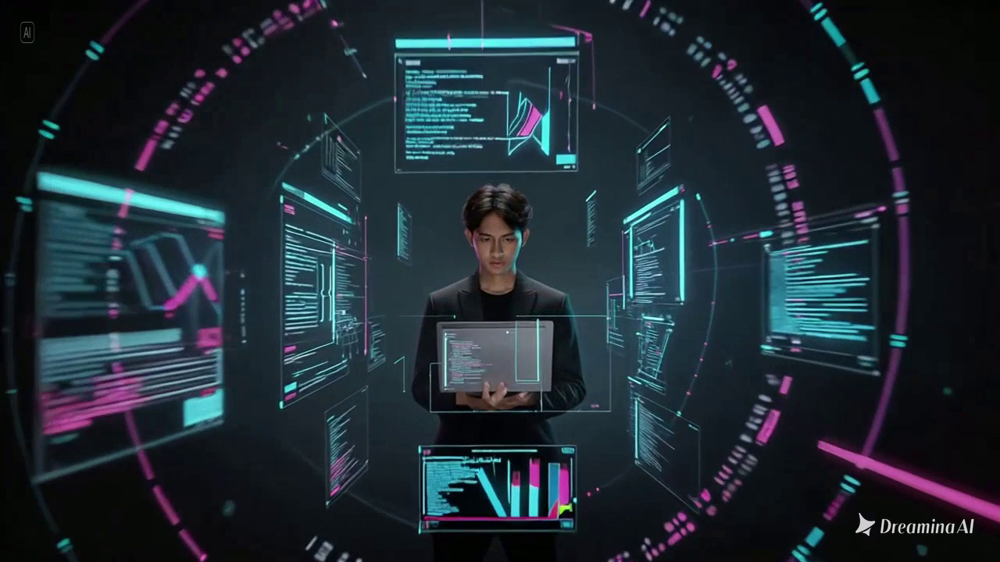

# RVLDPORTO

<p align="center">
  <strong>The Architecture of Intelligence</strong><br />
  Interactive portfolio built with Next.js 15, motion-driven UI, and a streaming AI assistant mock.
</p>

<p align="center">
  
</p>

<p align="center">
  <a href="https://nextjs.org"></a>
  <a href="https://react.dev"></a>
  <a href="https://www.typescriptlang.org"></a>
  <a href="https://tailwindcss.com"></a>
  <a href="https://www.framer.com/motion/"></a>
  
</p>

## Overview

`RVLDPORTO` adalah website portfolio interaktif dengan nuansa terminal-cyberpunk.  
Landing page dibangun sebagai pengalaman scroll sinematik: dari preloader, image-sequence hero, hingga AI chat widget floating dengan streaming response.

## Highlight Features

- **Cinematic preloader** dengan progress real-time untuk preload 121 frame hero.
- **Scroll-driven image sequence** berbasis canvas (`400vh`) untuk pengalaman visual sinematik.
- **Interactive particle grid** yang responsif terhadap cursor/touch.
- **Live system console** bergaya terminal dengan stateful command output.
- **Prompt showcase** dengan copy prompt cepat.
- **Responsive bento work grid** dengan hover/tap reveal code snippets.
- **Animated stats counter**, testimonial slider, dan CTA section ber-canvas grid.
- **Floating AI assistant** dengan endpoint streaming (`/api/chat`) di **Edge Runtime**.
- **Smooth scroll engine** dengan `lenis`.

## Experience Flow

```text
Boot Loader -> Hero Sequence -> Tech Arsenal -> Live Console
-> Prompt Showcase -> Selected Work -> Stats -> Testimonials
-> CTA Grid -> Floating AI Assistant
```

## Tech Stack

- **Framework:** Next.js 15 (App Router), React 18
- **Language:** TypeScript
- **Styling:** Tailwind CSS + custom neon utility classes
- **Animation:** Framer Motion
- **Smooth Scrolling:** Lenis
- **Icons:** React Icons
- **Image Optimization:** WebP output preference (`next.config.mjs`)
- **API Runtime:** Edge (`app/api/chat/route.ts`)

## Project Structure

```bash
.
|-- app/
|   |-- api/chat/route.ts
|   |-- globals.css
|   |-- layout.tsx
|   `-- page.tsx
|-- components/
|   |-- AIChat.tsx
|   |-- BentoGrid.tsx
|   |-- CTASection.tsx
|   |-- LiveConsole.tsx
|   |-- Navbar.tsx
|   |-- Preloader.tsx
|   |-- PromptShowcase.tsx
|   |-- SequenceScroll.tsx
|   |-- StatsSection.tsx
|   |-- TechStack.tsx
|   `-- TestimonialSlider.tsx
|-- hooks/
|   |-- usePreloadImages.ts
|   `-- useSmoothScroll.ts
|-- public/sequence/             # 121 hero frames
|-- tailwind.config.ts
|-- next.config.mjs
`-- package.json
```

## Quick Start

### Prerequisites

- Node.js `>= 20.0.0`
- npm `>= 10`

### Install & Run

```bash
npm install
npm run dev
```

Open `http://localhost:3000`.

### Build for Production

```bash
npm run build
npm run start
```

## Available Scripts

- `npm run dev` - start development server
- `npm run build` - production build
- `npm run start` - serve production build
- `npm run lint` - run Next.js lint checks

## AI Chat API (Mock Streaming)

Endpoint: `POST /api/chat`

Request body:

```json
{
  "messages": [
    { "role": "user", "content": "what is your stack?" }
  ]
}
```

Current behavior:

- Rule-based response (simple keyword matching)
- Word-by-word stream simulation
- Designed as mock layer sebelum integrasi LLM real

## Customization Guide

- Ubah identitas utama: `app/layout.tsx`, `components/SequenceScroll.tsx`, `components/CTASection.tsx`
- Ubah list project: `components/BentoGrid.tsx`
- Ubah stats section: `components/StatsSection.tsx`
- Ubah testimonial: `components/TestimonialSlider.tsx`
- Ubah prompt cards: `components/PromptShowcase.tsx`
- Ubah behavior AI chat: `app/api/chat/route.ts`, `components/AIChat.tsx`
- Ubah warna/tema: `tailwind.config.ts`, `app/globals.css`
- Ubah jumlah frame hero: `app/page.tsx` + isi folder `public/sequence/`

## Notes

- Beberapa data masih placeholder (email, social link, testimonial, project copy).
- Untuk production, ganti mock chat API dengan provider LLM (OpenAI, dsb).
- Jika ada karakter aneh di teks UI, pastikan file tersimpan dengan encoding UTF-8.

## License

This project is currently unlicensed. Add a `LICENSE` file before public distribution.
